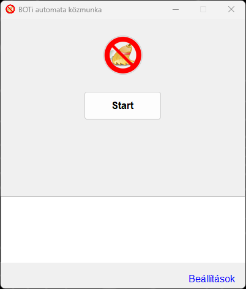
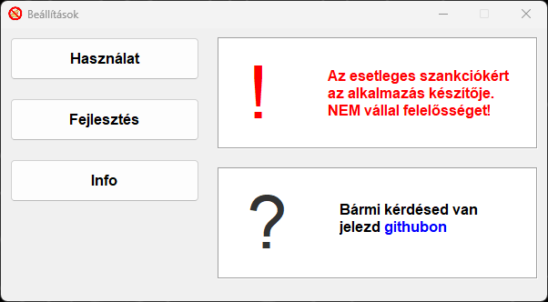

<br />
<div align="center">
  <a href="https://github.com/palicz/wlsboti">
    
  </a>
</div>

<h3 align="center">BOTi Automata</h3>


<p align="center"> A BOTi Automata Közmunka egy Python alapú bot, ami segít a közmunka végrehajtásának automatizálásában WLS FiveM Roleplay szerveren belül.</p>

<div align="center">
    
    
</div>

## Funkciók

- **Fotóelemzés és mozgásvezérlés:** A bot képes képernyőképeket analizálni, és az alapján vezérelni a karakter mozgását.
- **GUI:** Egyszerű grafikus felhasználói felület a funkciók kezeléséhez és indításához.

## Telepítés és Futtatás

1. **Python Telepítése:** A projekt futtatásához Python szükséges. Telepítsd a [Python](https://www.python.org/) legfrissebb verzióját.

> [!CAUTION]
> **"Add python.exe to path"**: Ezt az opciót mindenképpen pipáld be a telepítés során, hogy később lehessen használni a dedikált parancsokat a parancssorban!

2. **Könyvtárak Telepítése:** Nyisd meg a parancssort, és telepítsd a szükséges könyvtárakat a következő parancsokkal:
   ```bash
   pip install numpy opencv-python pillow pywin32
   ```

3. **Futtatás**: Töltsd le a projektet, majd a projekt mappájában indítsd el a fő Python fájlt:
    ```bash
    python boti.py
    ```
4. **Továbbiak:** A további szükséges tennivalókat a script használatához megtalálod a ```Beállítások > Használat" fülön.


## Licenc

Ez a projekt az *MIT Licenc* alatt áll. Részletekért olvasd el a LICENSE fájlt.

*Bármilyen kérdés, javaslat vagy probléma esetén nyugodtan lépj kapcsolatba a velem vagy nyiss egy issue-t a GitHub-on.*

[](https://choosealicense.com/licenses/mit/)